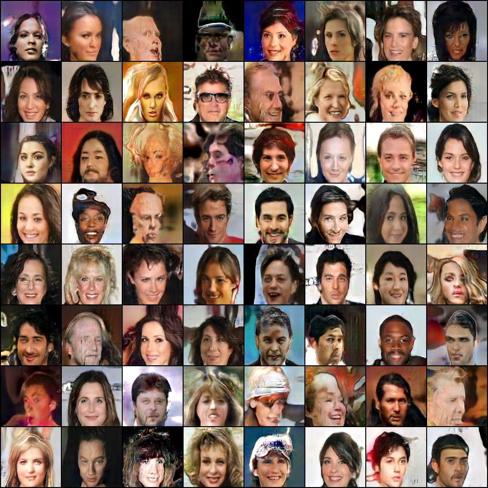

<h1>Face Generation using ProGAN</h1> 



Model that learns to generate images of human faces from input noise. The model consists of two neural networks that compete with each other, a critic (learns to tell true images from generated ones) and a generator (learns to fool the critic). Equilibrium is reached when the critic can no longer tell the difference between fake and real data (from the training set).

ProGANs gradually learn to generate high resolution images by starting with lower resolutions that capture high level features and progressively adding in more detail.

The generator is shown images from the [CelebA](http://mmlab.ie.cuhk.edu.hk/projects/CelebA.html) dataset during training.

<h2>Directory structure</h2>

| Dir | Description
| :--- | :----------
| &boxvr;&nbsp; networks | Contains different network architectures.
| &boxvr;&nbsp; trained_models | Generator and critic trained models for testing.
| &boxvr;&nbsp; generated_images | Images generated with different trained models.
| &boxv;&nbsp; &boxvr;&nbsp; 1x1 | 128x128 images of one face.
| &boxv;&nbsp; &boxur;&nbsp; grids | 8x8 grids of 128x128 images of faces.
| &boxur;&nbsp; other files ...

<h2>Test the critic</h2>

Loads one random image and scores it using trained critic.
```bash
$ python score_image.py
```

Loads image "generated_images/1x1/001.jpg" and scores it using trained critic "trained_models/deep-critic-128x128.pth".
```bash
$ python score_image.py --model_path=trained_models/deep-critic-128x128.pth --image_path=generated_images/1x1/001.jpg
```

Loads 5 random images and scores them using trained critic "trained_models/deep-critic-128x128.pth".
```bash
$ python score_image.py --model_path=trained_models/deep-critic-128x128.pth --image_path=random --iterations=5
```


<h2>Test the generator</h2>

Generates grid of 64 images using trained generator.
```bash
$ python generate_images.py
```

Generates one image using using trained generator "trained_models/deep-generator-128x128.pth".
```bash
$ python generate_images.py --model_path=trained_models/deep-generator-128x128.pth --grid_size=1
```

Generates 5 grids of 64 images using trained generator.
```bash
$ python generate_images.py --iterations=5
```

Images generated during testing are saved in "generated_with_preloaded_models".

<h2>Acknowledgements</h2>

['PROGRESSIVE GROWING OF GANS FOR IMPROVED QUALITY, STABILITY, AND VARIATION' (Karras et al., 2018).](https://arxiv.org/abs/1710.10196)
